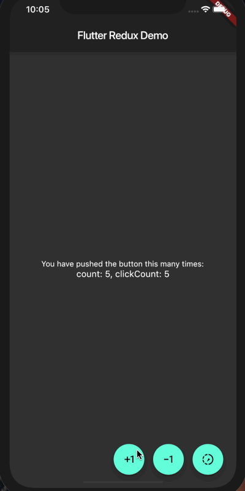

# 使用 redux 管理 flutter 应用数据

[redux](https://github.com/reduxjs/redux) 是什么？简单来说，就是为了解决 UI 层状态管理的方案，如果不熟悉，请先看文档学习一下，今天的重点不是学习 redux，而是直接用 redux 管理 flutter 的状态。

## 和 react 的比较

首先，flutter 和 [react](https://github.com/facebook/react) 真的太像了，连状态管理都有 [redux](https://github.com/reduxjs/redux) 方案:

| flutter | react |
| :--- | :-- |
| [redux.dart](https://github.com/johnpryan/redux.dart) | [redux](https://github.com/reduxjs/redux) |
| [flutter_redux](https://github.com/brianegan/flutter_redux) | [react-redux](https://github.com/reduxjs/react-redux) |
| [redux_thunk](https://github.com/brianegan/redux_thunk) | [redux-thunk](https://github.com/reduxjs/redux-thunk) |

另外，甚至还有 [redux-epics](https://pub.dartlang.org/packages/redux_epics) 能够搭配 [rxdart](https://github.com/ReactiveX/rxdart)  对标 [redux-observable](https://github.com/redux-observable/redux-observable)。对于 [rxjs](https://github.com/ReactiveX/rxjs) 熟悉的人应该也能够很快地开始 rxdart 了，再次证明知识是相似的，技能也是能够越学越快的。

为了不混淆大家，接下来我把 react 中的 redux 称为 `react/redux`, flutter 中的 redux 称为 `flutter/redux`。

## 正题

现在我们用 flutter 写一个简单的 redux 例子:



完整代码在 https://github.com/riskers/flutter_notebook_redux ，有过 redux 经验的应该能看明白。使用到了:

* redux
* flutter_redux
* redux_thunk

> 项目架构完全是之前按照我之前在 React 中的[经验](https://www.zhihu.com/question/50750032/answer/352985483)来做的

有几点需要注意:

1. 初始化 Store

  为了方便，可以在 state 中以一个[静态方法初始化](https://github.com/riskers/flutter_notebook_redux/blob/master/lib/store/main.dart#L20-L25):

  ```dart
  static AppState initialState() {
    return AppState(
      count: 0,
      clickCount: 0,
    );
  }
  ```

  然后在入口文件中[调用](https://github.com/riskers/flutter_notebook_redux/blob/master/lib/main.dart#L12):

  ```dart
  final store = Store<AppState>(
    reducers,
    middleware: [thunkMiddleware],
    initialState: AppState.initialState(),  // 调用
  );
  ```

2. reducer 复制对象的方法

  在 react/redux 中我们习惯这样写 reducer:

  ```js
  const reducer = (state={
    loading: false,
    data: [],
  }, action) => {
    switch(action.type) {
      case CONST.FETCH_GITHUB_SEARCH_USER_LOADING:
        return {
          ...state,
          loading: true
        }
      case CONST.FETCH_GITHUB_SEARCH_USER_SUCCESS:
        return {
          loading: false,
          data: action.payload.items
        }
      default:
        return state
    }
  }
  ```

  重点是 `...state` 这样的解构写法，实际是浅复制了 state 对象，而在 dart 中没有这么方便的方法，比如 [reducers.dart](https://github.com/riskers/flutter_notebook_redux/blob/master/lib/pages/home/reducers.dart#L4) 中的 `copyWith`:

  ```dart
  AppState counterReducer(AppState state, dynamic action) {
    switch (action) {
      case INCREMENT:
        return state.copyWith(count: state.count + 1);
      case DECREMENT:
        return state.copyWith(count: state.count - 1);
    }

    return state;
  }
  ```

  `copyWith` 是我们自己写的[扩展](https://github.com/riskers/flutter_notebook_redux/blob/master/lib/store/main.dart#L13-L18)方法：

  ```dart
  AppState copyWith({count, clickCount}) {
    return AppState(
      count: count ?? this.count,
      clickCount: clickCount ?? this.clickCount,
    );
  }
  ```

  `??` 是[条件表达式](https://www.dartlang.org/guides/language/language-tour#conditional-expressions)，`count: count ?? this.count` 表示 copyWith 只要没传进来 count 就把 AppState 实例的 count 值赋给 count，然后再实例化一个 AppState 对象。

  参见其他的[复制对象的方案](https://github.com/johnpryan/redux.dart/issues/21)

3. actions

  比较有特点的就是 redux_thunk 的异步 action 写法:

  ```dart
  ThunkAction asyncIncrement() {
    return (Store store) async {
      await Future.delayed(Duration(seconds: 3)); // 延迟 3 秒

      store.dispatch(INCREMENT);
    };
  }
  ```

  async / await 是不是很熟悉？

4. StoreProvider / StoreConnector

  StoreProvider 很简单，就是在根组件中挂载 store:

  ```dart
  @override
  Widget build(BuildContext context) {
    return StoreProvider<AppState>(
      store: store,
      child: MaterialApp(
        theme: ThemeData.dark(),
        home: Home(),
      ),
    );
  }
  ```

  而 StoreConnector 就比较麻烦了，需要先定义一个 ViewModel:

  ```dart
  class AppStateViewModel {
    final AppState state;
    final void Function() onClick;

    AppStateViewModel({
      this.state,
      this.onClick,
    });
  }
  ```

  ViewModel 中规定你要在这个组件中使用的 Store 中的数据

  ```dart
  class AddButton extends StatelessWidget {
    @override
    Widget build(BuildContext context) {
      return StoreConnector<AppState, AppStateViewModel>(
        converter: (store) {
          return AppStateViewModel(onClick: () {
            store.dispatch(INCREMENT);
            store.dispatch(CLICK);
          });
        },
        builder: (context, vm) {
          return Padding(
            padding: const EdgeInsets.all(8.0),
            child: FloatingActionButton(
              onPressed: vm.onClick,  // trigger!
              tooltip: 'Increment',
              child: Icon(Icons.exposure_plus_1),
            ),
          );
        },
      );
    }
  }
  ```

  StoreConnector 有两个方法:

  * `converter`: 使用给定的转换器函数将存储转换为 ViewModel，并将 ViewModel 传递给 builder 函数
  * `builder`: 承接 `converter` 返回的数据来使用

  以 AddButton 组件为例，converter 返回 onClick 函数来触发 dispatch,builder 承接到这个函数，这样就能在发起 dispatch，走 redux 的流程了。

----

本文只介绍 redux 在 flutter 中的应用，如果你对 React 很熟，你应该能明白 redux 的意义，除了有个全局 store 外，深层组件之间通信也不是问题了，对于 flutter 这种框架也是很有意义的。

当然，直接使用 redux 可能会比较重，这和 react 是类似的，小应用的话可以用全局总线来处理，甚至你可以一个界面就是一个 statefulwidget，直接都用 setState 来改变数据渲染界面，这样每个界面都是独立的数据了。

> 总体上来说，在 flutter 上使用 redux 还是很麻烦的，好在官方在 [2019 roadmap](https://github.com/flutter/flutter/wiki/Roadmap#ease-of-adoption) 中提到了要提供最佳实践，让我们期待吧！