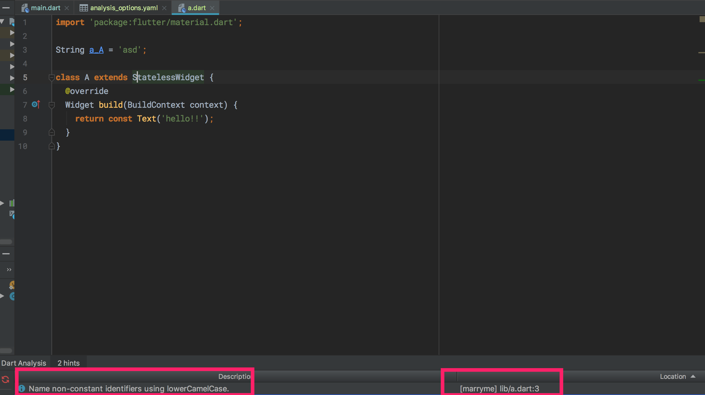
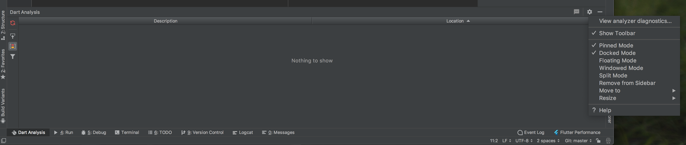

# Lint 工具

团队协作的第一步就是团队统一代码风格，前端有 ESLint 和 TSLint，dart 也就有 [dart Lint](https://github.com/dart-lang/linter)。

在根目录新建 `analysis_options.yaml` 文件，然后团队 leader 在熟悉 dart 之后可以根据需要配置 rules 就行了。

在 IDE 中的效果:

-----

dart lint 的全`部 rules 可见 http://dart-lang.github.io/linter/lints/。

如果你嫌一个个看麻烦，可以直接把 flutter 的 dart lint 抄过来: https://github.com/flutter/flutter/blob/master/analysis_options.yaml

最后，dart plugin 还提供了可视化的 analysis，点击查看:

