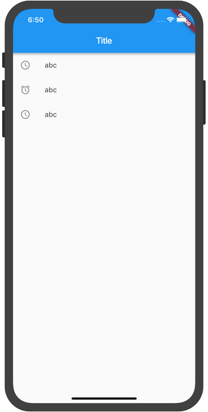
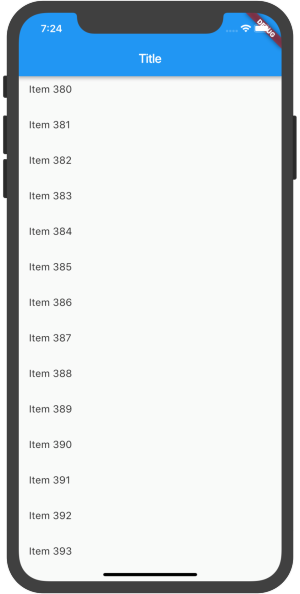
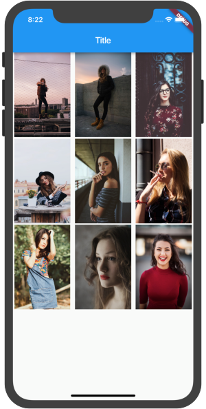
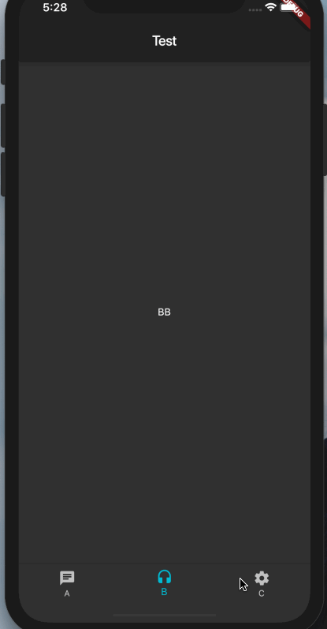

# ListView

### 静态

[Code](https://gist.github.com/riskers/ee71c1754117981bf7358359b390ff4e#file-static-listview-dart)

### 动态

[Code](https://gist.github.com/riskers/ee71c1754117981bf7358359b390ff4e#file-dynamic-listview-dart)

# GridView

[Code](https://gist.githubusercontent.com/riskers/ee71c1754117981bf7358359b390ff4e/raw/a532699e7591b4301f9287d16423f9f12ba75394/GridView.dart)

# TabBar

# BottomNavigationBar

[Code](https://gist.githubusercontent.com/riskers/ee71c1754117981bf7358359b390ff4e/raw/a532699e7591b4301f9287d16423f9f12ba75394/bottomnavigationbar.dart)

# Drawer